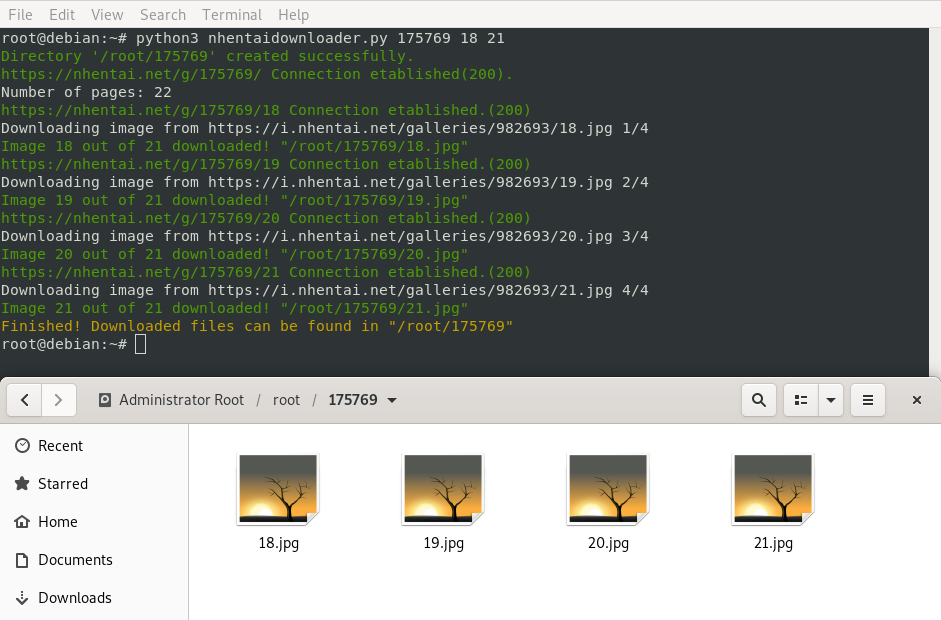

Software to download nhentai images without torrent.
## Usage
### Linux
Syntax:
- `python3 nhentaidownloader.py <DIGIT-CODE> [FIRST-PAGE [LAST-PAGE]]`

Example (download all pages):
- `python3 nhentaidownloader.py 175769`

Example (download pages from page 18 to last page):
- `python3 nhentaidownloader.py 175769 18`

Example (download pages from 18 to page 21):
- `python3 nhentaidownloader.py 175769 18 21`
###Windows
Syntax:
- `python nhentaidownloader.py <DIGIT-CODE> [FIRST-PAGE [LAST-PAGE]]`

Example (download all pages):
- `python nhentaidownloader.py 175769`

Example (download pages from page 18 to last page):
- `python nhentaidownloader.py 175769 18`

Example (download pages from 18 to page 21):
- `python nhentaidownloader.py 175769 18 21`
---
## Installation
### Linux (debian-based)
If you don't have installed python3:
- `sudo apt install python3`

If you don't have installed these python3 modules:
- `sudo apt install python3-requests && sudo apt install python3-termcolor`

### Windows
**Check if you have installed python:**
- Open PowerShell or CMD (*WindowsKey+R* and run *powershell*) and run `python`
- if python interpreter launched, type `exit()`, otherwise install python.

**Install Python:**
1. Navigate to https://www.python.org/downloads/windows/.
2. Select Python version you want to download.
3. Select file you want to download (eg. Windows x86-64 web-based installer)
4. Run python installer.
- [x] Add Python 3.X to PATH
- *Note: X stands for version number*
5. Select *Install Now* (or *Customize Installation*)
6. Select *Disable path length limit*
7. Close installer.

**Install Python Pip** (*https://pip.pypa.io/en/stable/installing/*)
1. Open PowerShell or CMD (*WindowsKey+R* and run *powershell*).
2. `curl https://bootstrap.pypa.io/get-pip.py -o get-pip.py`
3. `python get-pip.py`
4. check pip with `pip -V`

**Install Python Modules:**
- `python -m pip install requests`
- `python -m pip install termcolor`
